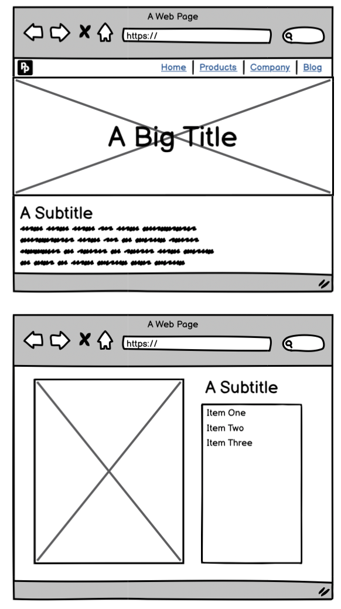
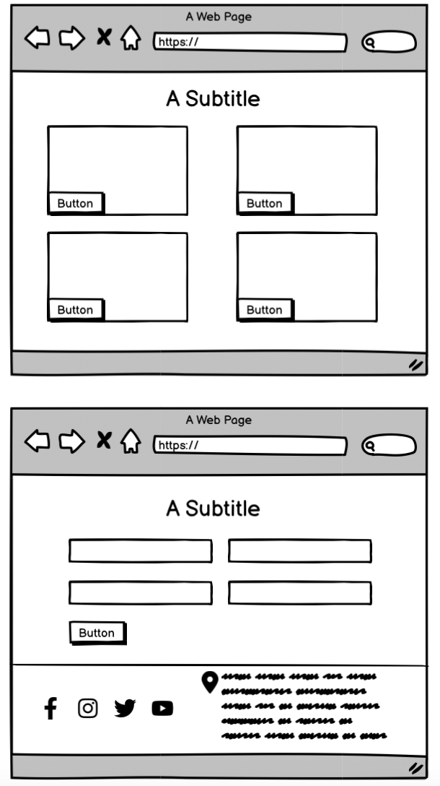

#Portfolio Project 1 - Diversity and Inclusion

This website was developed to meet the requirements of Code Institute’s first individual assessment project.

The live link can be found here: [Diversity and Inclusion Hub](https://bethneyanderson.github.io/diversity-and-inclusion/)

##Description
The Diversity & Inclusion Hub is a fully responsive HTML and CSS website created to inform and inspire individuals in cultivating inclusive environments and embracing diverse perspectives in both personal and professional settings.

##Wireframes
Before beginning the project, initial wireframes were designed to map out the final product. These included both mobile and desktop versions.

##How AI Was Used
Artificial Intelligence was instrumental in shaping this project. Here are some key ways AI contributed to its development:

**Code Generation**

AI tools, such as GitHub Copilot, were utilized to generate code snippets for different sections of the website, including its HTML structure and CSS styling. The AI offered context-aware suggestions, helping to streamline development and accelerate the coding process.

**Debugging**

AI-powered debugging tools were employed to detect and resolve coding issues. By analyzing the codebase, these tools identified potential bugs and provided recommendations for fixes, ensuring a smoother development process and a more reliable final product.

**Image Generation**

DALL-E, an AI model developed by OpenAI, was used to generate the images for the website.

**Content Assistance**

AI tools, such as GitHub Copilot, played a key role in both coding and content creation for the website. By offering smart suggestions and auto-completions, these tools helped streamline development, improve efficiency, and maintain high-quality code.

**Accessibility Improvements**

AI tools, such as Lighthouse, were utilized to evaluate the website’s accessibility features. These tools assessed how well the site accommodates users with disabilities and provided recommendations to enhance user experience, ensuring a more inclusive and user-friendly design.

By integrating AI, the project successfully enhanced efficiency, fostered creativity, and improved accessibility, resulting in a more streamlined and inclusive development process.

##Features

The website includes several features, which are detailed below.

###Existing Features

**Colour Palette**

The website incorporates shades of pink, a color often associated with compassion, warmth, and inclusivity. Pink evokes a sense of openness and connection, reinforcing the website’s commitment to fostering diversity and belonging. To ensure readability and a clean design, pink is complemented by neutral tones, creating a balanced and visually engaging experience. The color palette is consistently applied across all website elements, including backgrounds, text, buttons, and links, maintaining a cohesive and welcoming aesthetic.

.jpeg>)

**Iamgery**

A diverse range of images is used to enrich the content and create a more engaging experience. These visuals, generated using DALL-E, include representations of people, symbols, and illustrations that reflect the themes of diversity and inclusion. Each image is carefully selected to foster a sense of belonging, equity, and representation, reinforcing the website’s mission of inclusivity. To ensure accessibility and seamless user experience, all images are optimized for fast loading times and responsiveness, maintaining their quality across different devices. Additionally, alt text is provided for every image, improving accessibility for users with visual impairments and ensuring that all individuals can engage with the content effectively.

**Navigation**

The navigation bar, positioned at the top of the page, offers links to all key sections of the website, allowing users to easily move between pages. It highlights the active page with an underline for clear navigation. Designed to be fully responsive, the navigation bar adapts to different screen sizes, ensuring a seamless browsing experience across all devices.
