# Portfolio Project 1 - Diversity and Inclusion

This website was developed to meet the requirements of Code Institute’s first individual assessment project.

The live link can be found here: [Diversity and Inclusion Hub](https://bethneyanderson.github.io/diversity-and-inclusion/)

## Description

The Diversity & Inclusion Hub is a fully responsive HTML and CSS website created to inform and inspire individuals in cultivating inclusive environments and embracing diverse perspectives in both personal and professional settings.

## 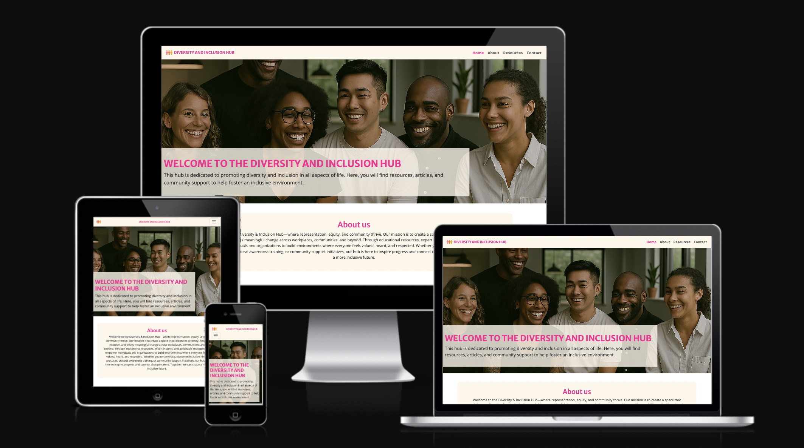

## Wireframes

Before beginning the project, initial wireframes were designed to map out the final product. These included both mobile and desktop versions.

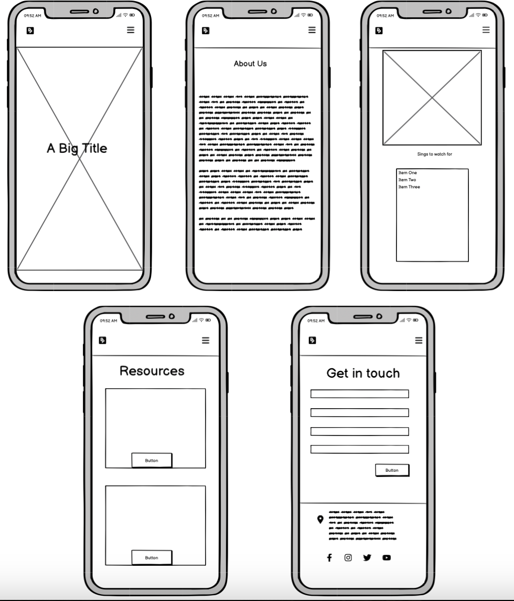
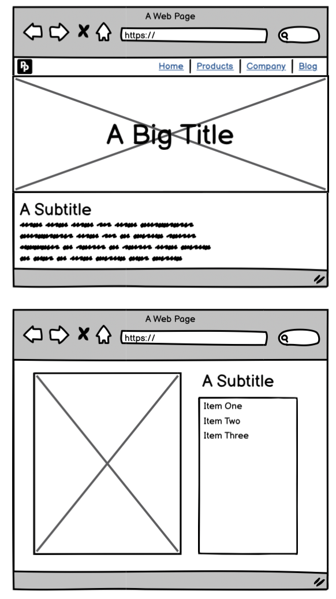
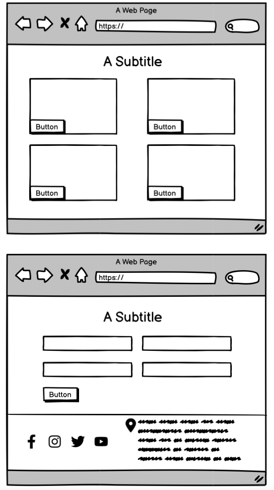

---

## How AI Was Used

Artificial Intelligence was instrumental in shaping this project. Here are some key ways AI contributed to its development:

- **Code Generation**

AI tools, such as GitHub Copilot, were utilized to generate code snippets for different sections of the website, including its HTML structure and CSS styling. The AI offered context-aware suggestions, helping to streamline development and accelerate the coding process.

- **Debugging**

AI-powered debugging tools were employed to detect and resolve coding issues. By analyzing the codebase, these tools identified potential bugs and provided recommendations for fixes, ensuring a smoother development process and a more reliable final product.

- **Image Generation**

DALL-E, an AI model developed by OpenAI, was used to generate the images for the website.

- **Content Assistance**

AI tools, such as GitHub Copilot, played a key role in both coding and content creation for the website. By offering smart suggestions and auto-completions, these tools helped streamline development, improve efficiency, and maintain high-quality code.

- **Accessibility Improvements**

AI tools, such as Lighthouse, were utilized to evaluate the website’s accessibility features. These tools assessed how well the site accommodates users with disabilities and provided recommendations to enhance user experience, ensuring a more inclusive and user-friendly design.

By integrating AI, the project successfully enhanced efficiency, fostered creativity, and improved accessibility, resulting in a more streamlined and inclusive development process.

## Features

The website includes several features, which are detailed below.

### Existing Features

- **Colour Palette**

The website incorporates shades of pink, a color often associated with compassion, warmth, and inclusivity. Pink evokes a sense of openness and connection, reinforcing the website’s commitment to fostering diversity and belonging. To ensure readability and a clean design, pink is complemented by neutral tones, creating a balanced and visually engaging experience. The color palette is consistently applied across all website elements, including backgrounds, text, buttons, and links, maintaining a cohesive and welcoming aesthetic.

.jpeg>)

- **Iamgery**

A diverse range of images is used to enrich the content and create a more engaging experience. These visuals, generated using DALL-E, include representations of people, symbols, and illustrations that reflect the themes of diversity and inclusion. Each image is carefully selected to foster a sense of belonging, equity, and representation, reinforcing the website’s mission of inclusivity. To ensure accessibility and seamless user experience, all images are optimized for fast loading times and responsiveness, maintaining their quality across different devices. Additionally, alt text is provided for every image, improving accessibility for users with visual impairments and ensuring that all individuals can engage with the content effectively.

- **Navigation**

The navigation bar, positioned at the top of the page, offers links to all key sections of the website, allowing users to easily move between pages. It highlights the active page with an underline for clear navigation. Designed to be fully responsive, the navigation bar adapts to different screen sizes, ensuring a seamless browsing experience across all devices.

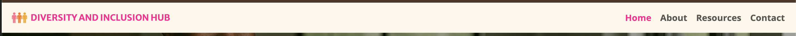

- **Hero Image**

The hero image serves as the website’s visual centerpiece, instantly engaging visitors. It features a striking image paired with a compelling headline that conveys the site’s purpose. This section is crafted to make a strong first impression and offer a concise preview of the site's content and message.

- **Information Sections**

The website highlights diversity and inclusion through well-structured sections that provide meaningful insights on fostering an inclusive environment. Each section is carefully organized with clear headings, engaging narratives, and impactful visuals, ensuring accessibility and representation for all users.

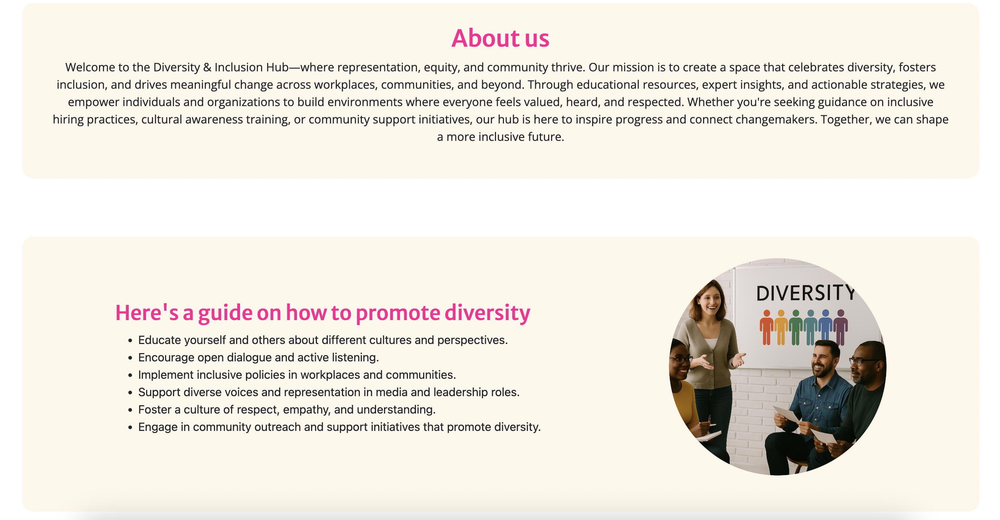

- **Contact Form**

The contact form provides users with a direct way to reach the website administrators. It features fields for name, email, and message, ensuring seamless communication. Built-in validation guarantees that all required information is correctly entered before submission, enhancing usability and reliability.

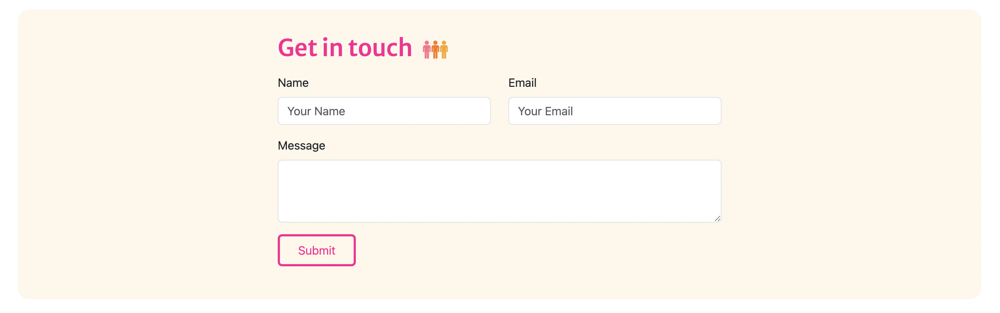

- **Footer**

The footer is consistent throughout all pages and includes social media links for Instagram, Facebook, X.

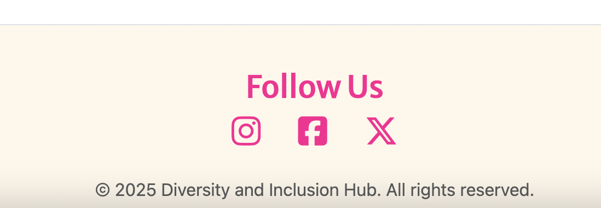

- **Success Page**

This section of the website acknowledges users for their submission and provides a seamless way to return to the home page with a simple button click. Additionally, the navigation bar links at the top ensure easy access back to the homepage for continued browsing.

## 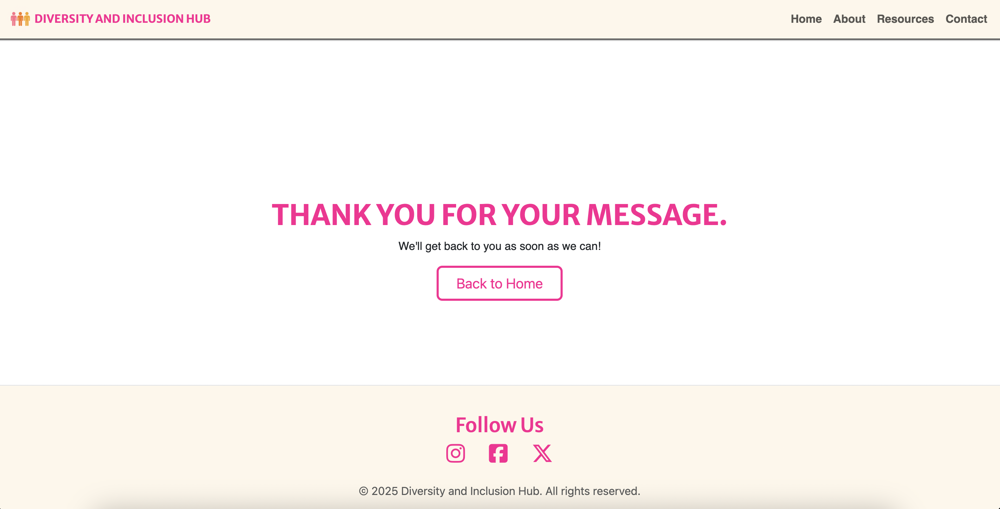

### Features left to Implement

- **Search Functionality**

Adding a search bar would allow users to quickly find specific information on the website, enhancing user experience by making navigation more efficient.

- **Multilingual Support**

Offering content in multiple languages enhances accessibility and inclusivity, ensuring diverse communities can engage with important information regardless of their primary language. This approach fosters equitable access and empowers non-English speakers to participate fully in discussions on diversity and inclusion.

- **Testimoials**

To boost credibility and engagement by showcasing authentic voices, fostering trust, and reinforcing the importance of inclusivity.

### Technologies Used

- HTML
- CSS
- Bootstrap

---

## Testing

- **W3C Markup Validation**
- **W3C CSS Validation**

All HTML and CSS code underwent validation using the W3C Markup Validation Service and W3C CSS Validation Service, respectively.

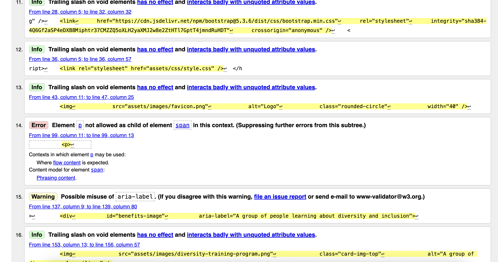
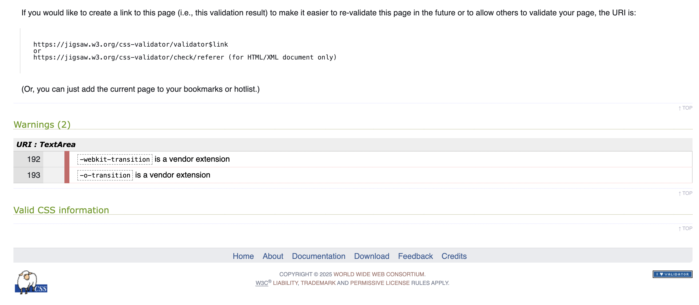

**Lighthouse Testing**

Lighthouse was used to test the performance, accessibility, best practices, and SEO of the website. The results are as follows:

## 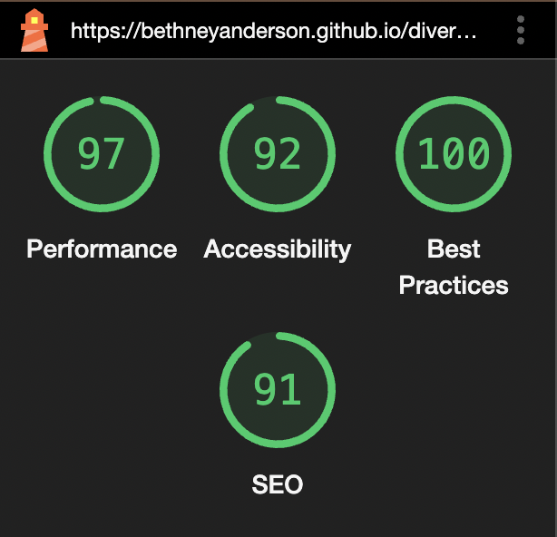

## Deployment

This project was deployed on GitHub. Below are the steps followed to deploy the website:

In the GitHub repository, navigate to the Settings tab.
Scroll down until GitHub Pages is found.
From the source section drop-down menu, select the main branch.
Once the main branch has been selected, hit the save button.
Finally, when the page is refreshed, a detailed ribbon display will indicate the successful deployment.

---

## Credits

**Content**

The content for this website was created by

- Copilot
- https://www.pewresearch.org/social-trends/2023/05/17/diversity-equity-and-inclusion-in-the-workplace/
- https://www.cipd.org/uk/knowledge/guides/inclusive-employers/
- https://www.communityfoundation.org.uk/about-us/diversity-equity-and-inclusion/

**Media**

All images used in this project were generated using DALL-E and are used with permission.
Icons used in the navigation bar and footer are from Font Awesome.
